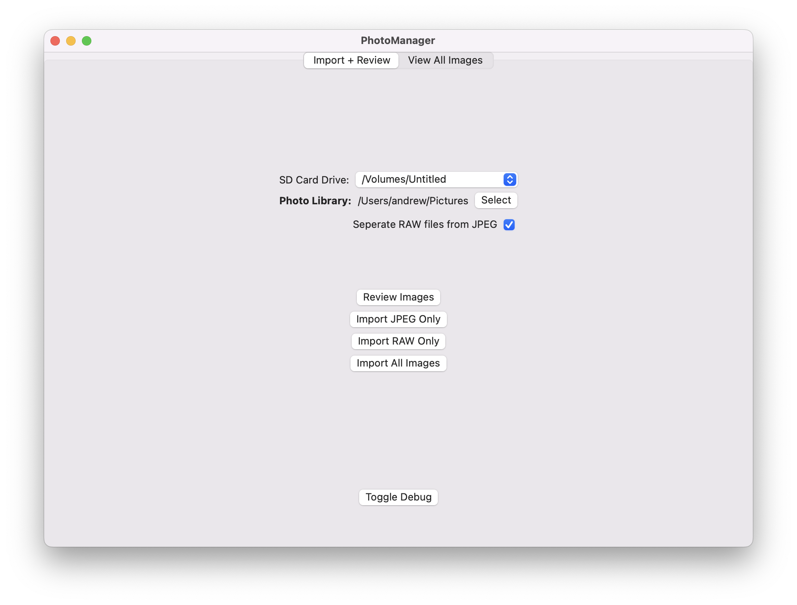

# PhotoManager

## What is this?
This is a simple SwiftUI macOS app that I'm building in order to replace LightRoom (initally just for my needs). I'm currently focused on optimizing my RAW+JPEG Photography workflow and keeping my photo library organized.

## V0

